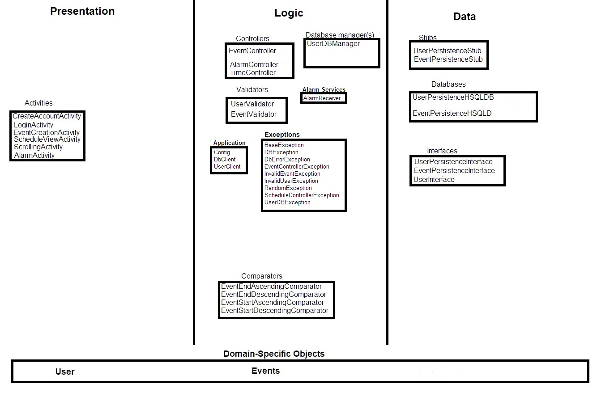

# Iteration 1 

## Architecture diagram 

## Presentation Layer

### Activity
[activity/ScrollingActivity](https://code.cs.umanitoba.ca/3350-winter-2021-a03/Team-7/-/blob/master/app/src/main/java/comp3350/team7/scheduleapp/presentation/activity/ScrollingActivity.java)
- View containing list of event and a button, when on click will make a transition to create event activity 
[activity/EventCreationActivity](https://code.cs.umanitoba.ca/3350-winter-2021-a03/Team-7/-/blob/master/app/src/main/java/comp3350/team7/scheduleapp/presentation/activity/EventCreationActivity.java)
- View for adding event details before create it with a save button
[activity/LoginActivity](https://code.cs.umanitoba.ca/3350-winter-2021-a03/Team-7/-/blob/master/app/src/main/java/comp3350/team7/scheduleapp/presentation/activity/LoginActivity.java)
- Login or Create Account 
- If login:
    - View for adding authentication details of user, before transition to ScrollingActivity
- else: 
    - transition to CreateAccoutActivity

[activity/CreateAccountActivity](https://code.cs.umanitoba.ca/3350-winter-2021-a03/Team-7/-/blob/master/app/src/main/java/comp3350/team7/scheduleapp/presentation/activity/CreateAccountActivity.java)
- View for user to adding user details and set password before transition to ScrollingActivity

[activity/AlarmActivity](https://code.cs.umanitoba.ca/3350-winter-2021-a03/Team-7/-/blob/master/app/src/main/java/comp3350/team7/scheduleapp/presentation/activity/AlarmActivity.java)
- View creating/managing the alarms for a User's scheduled event

[activity/EventCreationActivity](https://code.cs.umanitoba.ca/3350-winter-2021-a03/Team-7/-/blob/master/app/src/main/java/comp3350/team7/scheduleapp/presentation/activity/EventCreationActivity.java)
- This is what the users would see when they want to create a new event

[activity/SceduleViewActivity](https://code.cs.umanitoba.ca/3350-winter-2021-a03/Team-7/-/blob/master/app/src/main/java/comp3350/team7/scheduleapp/presentation/activity/ScheduleViewActivity.java)
- Displays the user's schedule on a selected date

[activity/BaseActivity](https://code.cs.umanitoba.ca/3350-winter-2021-a03/Team-7/-/blob/master/app/src/main/java/comp3350/team7/scheduleapp/presentation/base/BaseActivity.java)
- Error handling for all activities

### Adapter 
[adapter/RecyclerViewAdapter](https://code.cs.umanitoba.ca/3350-winter-2021-a03/Team-7/-/blob/master/app/src/main/java/comp3350/team7/scheduleapp/presentation/adapter/RecyclerViewAdapter.java)
- A adapter for recyclerView where each view holder store Event details 
- Adapter put EventController in work and notify view changes when detect user action like remove, undo, add,..
 
### Fragment
[fragment/ErrorDialog](https://code.cs.umanitoba.ca/3350-winter-2021-a03/Team-7/-/blob/master/app/src/main/java/comp3350/team7/scheduleapp/presentation/fragment/ErrorDialog.java)
- A dialog fragment used to diplay any error messages

### UI Helper
[UiHelper/ItemOffsetDecoration](https://code.cs.umanitoba.ca/3350-winter-2021-a03/Team-7/-/blob/master/app/src/main/java/comp3350/team7/scheduleapp/presentation/UiHelper/ItemOffsetDecoration.java)
- Decoration, create offset between each viewholder in recycler view
[UiHelper/RecyclerViewOnItemtouchHelper](https://code.cs.umanitoba.ca/3350-winter-2021-a03/Team-7/-/blob/master/app/src/main/java/comp3350/team7/scheduleapp/presentation/UiHelper/RecyclerViewOnItemtouchHelper.java)
- Gesture detection, currently support swipe right

## Logic Layer 

- [logic/EventController](https://code.cs.umanitoba.ca/3350-winter-2021-a03/Team-7/-/blob/master/app/src/main/java/comp3350/team7/scheduleapp/logic/EventController.java)
    - This is where we put the logic, the controller validate user input and ask data from persisten
    - when the data is available, control pass it to view 
    - Handle exception from database
    - Throw exception to the presentation layer, if they are the caller and have given an invalid argument  
- [logic/EventValidator](https://code.cs.umanitoba.ca/3350-winter-2021-a03/Team-7/-/blob/master/app/src/main/java/comp3350/team7/scheduleapp/logic/EventValidator.java)
    - validation for an event 
- [logic/SORTNAME](https://code.cs.umanitoba.ca/3350-winter-2021-a03/Team-7/-/blob/master/app/src/main/java/comp3350/team7/scheduleapp/logic/SORTNAME.java)
    - enum class, contains many way of sorting we want to use 
- [logic/UserValidator](https://code.cs.umanitoba.ca/3350-winter-2021-a03/Team-7/-/blob/master/app/src/main/java/comp3350/team7/scheduleapp/logic/UserValidator.java)
    - Used to validate any user input from LoginActivity and CreateAccountActivity
    - accepts any implementation of the UserPersistenceInterface
    - Checks if the User is a valid User in the Database
- [logic/UserDBManager](https://code.cs.umanitoba.ca/3350-winter-2021-a03/Team-7/-/blob/master/app/src/main/java/comp3350/team7/scheduleapp/logic/UserDBManager.java)
    - Used to manage the interaction between the UI Activities and the UserPersistence
    - Accepts any implementation of UserPersistenceInterface
    - Handles new User registrations and User logins
- [logic/AlarmController](https://code.cs.umanitoba.ca/3350-winter-2021-a03/Team-7/-/blob/master/app/src/main/java/comp3350/team7/scheduleapp/logic/AlarmController.java)
    - This contains the logic for the alarm notifications for any upcoming scheduled events
    - Sends the notification to the User/client's device
- [logic/TimeController](https://code.cs.umanitoba.ca/3350-winter-2021-a03/Team-7/-/blob/master/app/src/main/java/comp3350/team7/scheduleapp/logic/TimeController.java)
    - handles time offset conversion from minutes to milliseconds and milliseconds to minutes
   
### Comparators
[EventEndAscendingComparator](https://code.cs.umanitoba.ca/3350-winter-2021-a03/Team-7/-/blob/master/app/src/main/java/comp3350/team7/scheduleapp/logic/comparators/EventEndAscendingComparator.java)
- sort base on event end time in ascending order

[EventEndDescendingComparator](https://code.cs.umanitoba.ca/3350-winter-2021-a03/Team-7/-/blob/master/app/src/main/java/comp3350/team7/scheduleapp/logic/comparators/EventEndDescendingComparator.java)
- sort base on event end time in descending order

[EventStartAscendingComparator](https://code.cs.umanitoba.ca/3350-winter-2021-a03/Team-7/-/blob/master/app/src/main/java/comp3350/team7/scheduleapp/logic/comparators/EventStartAscendingComparator.java)
- sort base on event start time in ascending order

[EventStartDescendingComparator](https://code.cs.umanitoba.ca/3350-winter-2021-a03/Team-7/-/blob/master/app/src/main/java/comp3350/team7/scheduleapp/logic/comparators/EventStartDescendingComparator.java)
- sort base on event start time in ascending order

### Exceptions 
[BaseException](https://code.cs.umanitoba.ca/3350-winter-2021-a03/Team-7/-/blob/master/app/src/main/java/comp3350/team7/scheduleapp/logic/exceptions/base/BaseException.java)
- Implements a Heirarchy to all exception

[DbErrorException](https://code.cs.umanitoba.ca/3350-winter-2021-a03/Team-7/-/blob/master/app/src/main/java/comp3350/team7/scheduleapp/logic/exceptions/DbErrorException.java)
- Custom Database exception

- Sends a message to the User to inform them of what went wrong, why it went wrong and how to correct it. 
[DBException](https://code.cs.umanitoba.ca/3350-winter-2021-a03/Team-7/-/blob/master/app/src/main/java/comp3350/team7/scheduleapp/logic/exceptions/DBException.java)
- Runtime DB Exception

[EventControllerException](https://code.cs.umanitoba.ca/3350-winter-2021-a03/Team-7/-/blob/master/app/src/main/java/comp3350/team7/scheduleapp/logic/exceptions/EventControllerException.java)
- casts the Exceptions thrown by EventController for specific handlers

[InvalidUserException](https://code.cs.umanitoba.ca/3350-winter-2021-a03/Team-7/-/blob/master/app/src/main/java/comp3350/team7/scheduleapp/logic/exceptions/InvalidUserException.java)
- used to for handling exceptions caused by inputting invalid user information

[InvalidEventException](https://code.cs.umanitoba.ca/3350-winter-2021-a03/Team-7/-/blob/master/app/src/main/java/comp3350/team7/scheduleapp/logic/exceptions/InvalidEventException.java)
- Custom invalid event exception

[RandomException](https://code.cs.umanitoba.ca/3350-winter-2021-a03/Team-7/-/blob/master/app/src/main/java/comp3350/team7/scheduleapp/logic/exceptions/RandomException.java)
- this is special, for creating fake database, use only to create random event in EventDbStub

[UserDBException](https://code.cs.umanitoba.ca/3350-winter-2021-a03/Team-7/-/blob/master/app/src/main/java/comp3350/team7/scheduleapp/logic/exceptions/UserDBException.java)
- Custom Exception for when User input could not be matched to anything in the UserDatabase

## Application
[Config](https://code.cs.umanitoba.ca/3350-winter-2021-a03/Team-7/-/blob/master/app/src/main/java/comp3350/team7/scheduleapp/application/Config.java)
- Deploys the app for production

[DbClient](https://code.cs.umanitoba.ca/3350-winter-2021-a03/Team-7/-/blob/master/app/src/main/java/comp3350/team7/scheduleapp/Application/DbServiceProvider.java)
- Singleton instantiation of the Databases
    - User Database
    - Event Database 
- Gives access to the databases based on what database is requested
- Reloads the Database files in cases where the databases are unsynced
- can be configured to deploy either the production database (HSQLDB) or the debug database (stubs)

[UserClient](https://code.cs.umanitoba.ca/3350-winter-2021-a03/Team-7/-/blob/master/app/src/main/java/comp3350/team7/scheduleapp/application/UserClient.java)
- Logs the Users that used the app

## Persistent Layer

[EventPersistenceInterface](https://code.cs.umanitoba.ca/3350-winter-2021-a03/Team-7/-/blob/master/app/src/main/java/comp3350/team7/scheduleapp/persistence/EventPersistenceInterface.java) 
- interface for all event database implementation

[EventPersistenceStub](https://code.cs.umanitoba.ca/3350-winter-2021-a03/Team-7/-/blob/master/app/src/main/java/comp3350/team7/scheduleapp/persistence/stubs/EventPersistenceStub.java) 
- Stub with concrete information
- Used for integration testing of the Event Database

[EventPersistenceHSQLDB](https://code.cs.umanitoba.ca/3350-winter-2021-a03/Team-7/-/blob/master/app/src/main/java/comp3350/team7/scheduleapp/persistence/hsqldb/EventPersistenceHSQLDB.java)
- Actual HSQLDB Implementation for EventPersistence
- Persistent database that saves into a database file in Assets/db

[UserPersistenceInterface](https://code.cs.umanitoba.ca/3350-winter-2021-a03/Team-7/-/blob/master/app/src/main/java/comp3350/team7/scheduleapp/persistence/UserPersistenceInterface.java)
- Design by contract for all UserPersistence implementation

[UserPersistenceStub](https://code.cs.umanitoba.ca/3350-winter-2021-a03/Team-7/-/blob/master/app/src/main/java/comp3350/team7/scheduleapp/persistence/stubs/UserPersistenceStub.java)
- Stub that contains 4 entries (the memebers of Group 7)
- Used for Integration testing

[UserPersistenceHSQLDB](https://code.cs.umanitoba.ca/3350-winter-2021-a03/Team-7/-/blob/master/app/src/main/java/comp3350/team7/scheduleapp/persistence/hsqldb/UserPersistenceHSQLDB.java)
- Actual HSQLDB Implementation for UserPersistence
- Persistent database that saves into a database file in Assets/db

