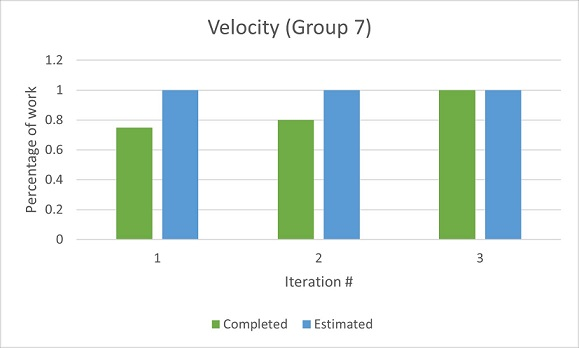

## Part of the project that has not been as successful as we would have liked?
We had planned for a bunch of large Features that we should have broken down into smaller components which ended up coming back throughout the whole project duration some as technical debt that we had to keep paying off. As such, we were only able to implement about half the features that we originally planned to have by iteration 3. If we had spent more time during the designing/brain storming phase of the project, we could have made more refined choices which could have made it easier to write tests, help the other members with debugging their codes. Another issue we had was that we needed to communicate any code improvements/refactors we could do/plan to do with everyone before making a commit to the development branch, or have it as a separate branch to be reviewed before merging it together in development branch to run any integration or system tests.

## How can it be improved in this iteration?
We could improve this by prioritizing paying off all the outstanding technical debt that we owe and finish up any currently ongoing features that we are working before we start working on any new features that we would have originally planned at the start of the Project; we would also have to break each new feature down further into smaller more manageable parts or components so that we can easily work on them in one to two Coding segments/business days. By doing this, we would be able to give a proper time estimate on how long each component would realistically take.

## Determine concrete (and realistic) ways of improvement?
A concrete and realistic way to make this improvement is to keep breaking down each feature or user stories till we are sure that it can’t be broken down, Discuss and note down how we should be approaching or implementing each component as well as bounce off ideas with each other to refine how we envision each feature would work. We also have to make sure to keep everything grounded in reality and what we are actually capable of developing or making such that we would be able to deliver a working prototype per iteration and a fully working finished product.
How its success will be evaluated at the end of the iteration?
The success of our project will be determined by its usefulness for the user. If the app is something the user feels inclined to use and maintain throughout their day and incorporate into their routine, it will be a success. This would be accomplished through the simplicity and intuitiveness of the application which would allow users of all demographics to manage their time with ease. Although, we were not able to incorporate more exciting features to distinguish our product from competitors, we believe that with a dedicated user base, we would receive valuable feedback pertaining to the growth of the platform from our valued users. We also see this as a success. 

## Project Velocity Documentation and chart

Unfortunately, we did not properly document our velocity throughout the iterations. Most of the data in the graph is determined through our discussion in class from when we were discussing velocity as a topic. 

Iteration 1:
We did poorly. We assumed to much work in the iteration and underperformed our expectation. We ended up having to assign work for uncompleted features to the next iteration. We ended up with prudent inadvertent technical debt for the user database which was eventually resolved in the next iteration.

Iteration 2:
Ultimately, the amount of work we completed was closer to what we estimated. Closer to the deadline we realized that we needed to ignore failing tests in order to salvage other parts of the system in order for it to function.

Iteration 3:
After discussing velocity in class we realized that we had to plan out our time much better in order to maintain our goals for the iteration and end product. We laid out all work that needed to be completed within the time frame of the iteration and improved upon our time management in order to complete these tasks.
