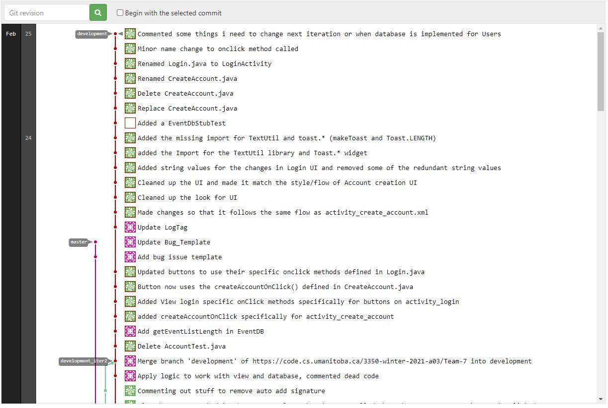

Iteration 1 Worksheet
========================================

Adding a Feature:
-------
As our project will be a Schedule management app, we would need a way for our users to access our app and be able to save their schedules into such that it is easily accessible for them to view. What we needed to create was an **Account** feature to our project where the users would be able save events onto their schedule and this would help them keep track of their busy day-to-day lives. By having this feature, we are allowing the users to make personalized schedule for each day and allow them to easily access any events on their schedule for further information about the event. 

We have broken the account feature into two different activities to make it simple to use and easy to understand.
- CreateAccountActivity
    - this lets any new user create their account
    - after the account is created, it would automatically log the users in and load up their homepage
- LoginActivity
    - This would allow the user to either
        - Login to their account
        - Create a new account by going to the CreateAccountActivity

Links
--------
[Create an Account](https://code.cs.umanitoba.ca/3350-winter-2021-a03/Team-7/-/issues/14)

[US: New User](https://code.cs.umanitoba.ca/3350-winter-2021-a03/Team-7/-/issues/15)

[User Login](https://code.cs.umanitoba.ca/3350-winter-2021-a03/Team-7/-/issues/16)

[US: Account Login](https://code.cs.umanitoba.ca/3350-winter-2021-a03/Team-7/-/issues/27)

Exceptional Code
-----
[EventController.java](https://code.cs.umanitoba.ca/3350-winter-2021-a03/Team-7/-/blob/development/app/src/main/java/comp3350/team7/scheduleapp/logic/EventController.java)

For EventController, We would need to test the validity of the event the user wants to create and we would also need to test if the event exists in the database entry for the user such that they can update/remove it later on. If we are dealing with a valid event, We are updating the event entry in the database based on the changes that the user have made and return the updated event list. If it is the case that the event being updated is an invalid event, we would notify the user that they do not have that event and that they cannot make any changes to a non-existing event.

Branching
------
[Branching Strategy](https://code.cs.umanitoba.ca/3350-winter-2021-a03/Team-7/-/blob/development/Iter1%20worksheet%20references/Branching%20Strategy.md)

